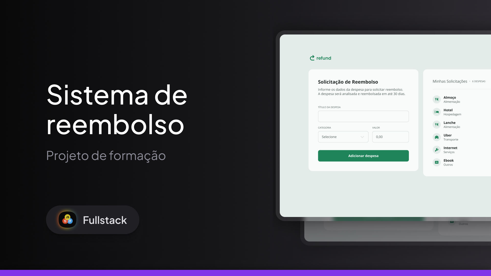

<h1 align="center">Refund System</h1>

  <a href="#-technologies">Technologies</a>&nbsp;&nbsp;&nbsp;|&nbsp;&nbsp;&nbsp;
  <a href="#-project">Project</a>&nbsp;&nbsp;&nbsp;|&nbsp;&nbsp;&nbsp;
  <a href="#-layout">Layout</a>

 

  

## 🚀 Technologies

This project was developed with the following technologies:

## 💻 Project

Refund is a web application for requesting reimbursement and listing expenses.

##  Layout

You can view the project layout through [FROM THIS LINK](https://www.figma.com/design/J6mNZ21jtq5XJeN0Dyctag/Sistema-de-reembolso--Community-?node-id=0-1&t=hQcpN2o1oYz2Fyo9-1). It is necessary to have an account on
 [Figma](https://figma.com) to access it.

 ## 🌍 Deployment

You can access the project directly through GitHub Pages:  
👉 [Refund on GitHub Pages](https://augusto-valerio.github.io/Refund/)

---

Made by : [Augusto Valerio](https://github.com/Augusto-Valerio).
